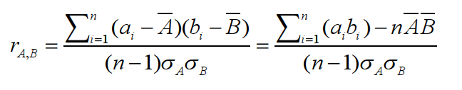
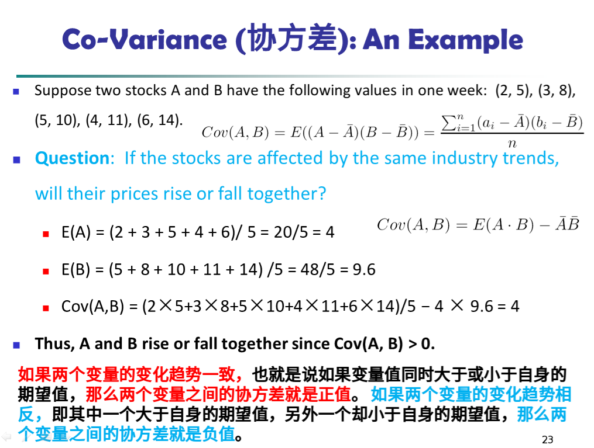

# Data Mining 知识点
***
## 背景(为什么要Data Mining)
我们处在信息时代，这个时代不缺乏数据,数据库中的数据量急速膨胀，但是缺乏有价值的信息(当然也缺乏获取有用信息的人)。

于是产生了KDD(knowledge discovery in dadabase),Data Mining 是KDD的一个步骤。
## Data Minng 概念
从*大量的,不完全的，有噪声的，模糊的，随机的*数据中,提取*隐含在其中的，人们事先不知道的，但又是潜在信息和知识*的过程。

知识发现(KDD)是“数据挖掘”的广义说法；数据挖掘是知识发现过程的核心。
## Similarity and Dissimilarity
相似度一般取值[0,1],而不相似度最小取0(eg:Distace)
### Minkowski Distance(明式距离)
公式略，自己查；又被成为L-h norm

**特殊情况**

    1. 哈弗曼距离(L-1 norm)
    2. 欧氏距离(l-2 norm)
    3. supuremum距离，或者称为棋盘距离

### Cosin Similarity(余弦相似度)

## 数据预处理
### Data Preprocessing 主要步骤

    1. Data Cleaning（missing,noisy,inconsistent)
    2. Data Integration
    3. Data Reduction
    4. Data Transformation

### Data Cleaning:处理*missing data*方法：

 the most probable value: inference-based （基于推理的）such as Bayesian formula or decision tree.

### Data Cleaning:处理*noisy data*方法:

**Binning （分级）**

*first sort data and partition into (equal-frequency) bins
then one can smooth by bin means, smooth by bin median, smooth by bin boundaries, etc.*

**Regression**

*smooth by fitting the data into regression functions*

**Clustering**

*detect and remove outliers*

**Combined computer and human inspection （人机检查）**

*detect suspicious （可疑的） values and check by human (e.g., deal with possible outliers)*

### Data Integration(数据整合)

含义：Combines data from multiple sources into a coherent store （统一存储）

**Handling Redundancy in Data Integration**
    1. 不同属性表示同一个意思(Object identification)
    2. 派生数据(Derivable data)

**Detection of redundant attributes**
    1.  correlation analysis
    2.  covariance analysis

 

 

### Data Reduction

**方法：**
    1. Dimensionality reduction
    2. Numerosity reduction
    3. Data compression

**Dimensionality reduction**

含义：remove unimportant attributes

方法：
    1. Wavelet transforms(小波变换)
    2. Principal Components Analysis (PCA)
    3. Feature subset selection, feature creation

特征提取与特征选择

     特征提取通过投影变换降维，它生成新特征。典型用途：图像，文档特征提取。
     特征选择从给定高维数据中选出一组最具描述性的有效特征，不生成新特征。典型用途：基因选择。

**Numerosity Reduction**

含义：Reduce data volume by choosing alternative, smaller forms (in volume ) of data representation

方法：
    1. Parametric methods
    2. Non-parametric methods

Parametric Data Reduction
    1. Linear regression
    2. Multiple regression
    3. Log-linear model

 Non-parametric Data Reduction
     1. histograms
     2. clustering
     3. sampling

**Data Compression**

含义：

A function that maps the entire set of values of a given attribute to a new set of replacement values s.t. each old value can be identified with one of the new values.

方法：

    1. Smoothing: Remove noise from data
    2. Attribute/feature construction
    3. Aggregation(聚合)
    4. Normalization: Scaled to fall within a smaller, specified range
